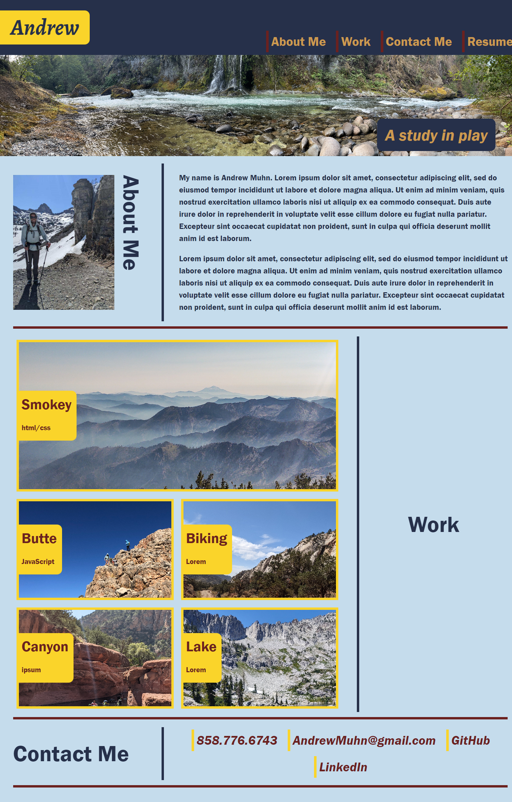

# <Muhn-Andrew-Porfolio>

## Description
-A work-in-progress Portfolio page that will continue to develop throughout my time in this coding bootcamp and potentially my career as a software engineer.
-In addition to practing and implementing CSS knowledge this webpage can serve as an actual portfolio page as I progress in coding and add more content.
-This project was a particular challenge in developing a functional knowledge of flexbox for arranging elements on a page as well as using media queries to add responsive design.

## Usage

-Nav bar at the top of the screen will redirect the UI to scroll to the coresponding section. (Resume Link will eventually link outside of webpage to actual resume. Currently a placeholder link)

-Work section images link to outside completed projects. (note: currently all images are placeholders and just link back to the top of the page)

-Contact Section Links to various contact elements outside of webpage.

.png)

## Credits

UofO EdX Bootcamp Coursework